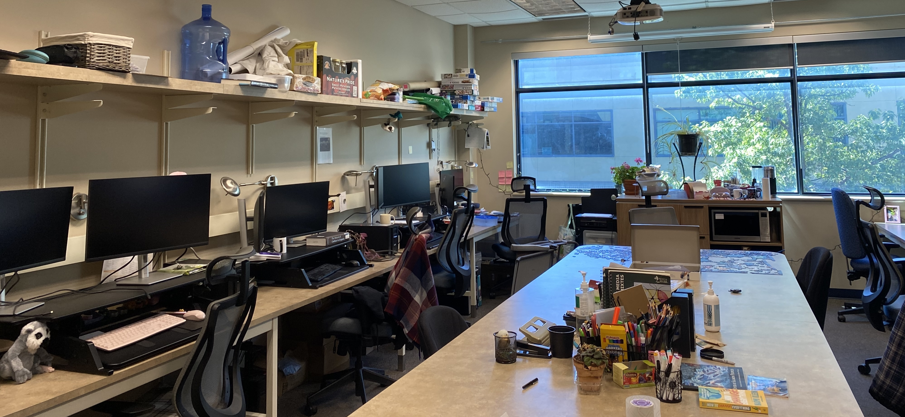

# Lab communication and organization {#communication}

## Onboarding

Welcome to the Quantitative Ecology Lab. In addition to the official UBCO onboarding process (obtaining study/work permits, getting set up with payroll), which you should coordinate with the appropriate departmental staff members, here are some things that you should talk to Dr. Noonan about doing when you arrive:

+ Read through this lab manual.
+ Join the lab [GitHub organization](https://github.com/QuantitativeEcologyLab).
+ Join the lab Slack organization.
+ Write your [Individual Development Plan](https://ubc.ca1.qualtrics.com/jfe/form/SV_doiyIDxnngnlklU).
+ Obtain SALTO access (discuss this with Dr. Noonan).
+ UBC offers access to software for students and staff. If you need MS Office, etc. you can download them [here](https://it.ubc.ca/services/desktop-print-services/software-licensing/list-software-available).
+ Complete any mandatory on-boarding courses on Workday.
+ Ensure you have remote access to the lab computers.

For graduate students & postdocs new to UBC:

+ You should also join the BRAES Slack organization (ask Dr. Noonan for an invite if needed).
+ Get your [UBC card](https://ok.ubc.ca/about/campus-services/ubccard/).
+ Book an onboarding meeting with Dr. Noonan [here](https://outlook.office.com/bookwithme/user/1bd87136607a422c9fc7baadedbc9f4d@ubc.ca?anonymous&ismsaljsauthenabled&ep=pcard).
+ Set up a UBC Zoom account (will allow Zoom calls of unlimited duration).

## Meetings

### Individual meetings with Dr. Noonan

As a general rule, Dr. Noonan does not schedule regular weekly, or bi-weekly meetings with students in the lab. Dr. Noonan's philosophy around meetings is that he is there for you if/when you need him, but will not impose a schedule upon you. There are times where you may need several meetings per week to get past difficult problems, and others when you might be able to work alone for several weeks without the need for a meeting. It is therefore up to each student to arrange meeting times that work for them. 

#### Booking a meeting

Meetings should be booked using the [booking page](https://outlook.office.com/bookwithme/user/1bd87136607a422c9fc7baadedbc9f4d@ubc.ca?anonymous&ismsaljsauthenabled&ep=pcard).

You have the option of booking one of three types of meetings:

+ 15 minutes - Quick Check-in. For single, well-defined questions or brief administrative matters: clarifying a specific method, reviewing a figure, confirming logistics, or following up on an email. Come with a clear question ready. _Can be booked up to 1 hour in advance._
+ 30 minutes – Standard Meeting. For focused topics with some back-and-forth: progress updates, manuscript feedback discussions, analytical questions, and follow-ups on ongoing analyses or work planning. _Must be booked 2 days in advance._
+ 1 Hour – In-Depth Meeting. For substantive discussions requiring extended time: thesis or dissertation chapter reviews, research proposal development, comprehensive data or methods troubleshooting, and initial onboarding meetings for new lab members. _Must be booked 2 days in advance._

#### Preparing for a meeting

Meetings are a chance for you to get focused time with Dr. Noonan to discuss and work on your research.

Each lab member will have a designated document (visible only to you and Dr. Noonan) for agendas and notes for our weekly meetings. By 3pm on the day before your meeting, update this file with the following information (don’t spend any more than 15 minutes on this, and don’t feel the need to use complete sentences):

+ Make a short agenda of any things you’d like to discuss in our meeting, in addition to your research plans and progress. I may add to these as well.
+ Annotate the plans from the previous week using either the ‘Comment’ feature or by adding text in a different color. We’ll use these notes as a tool for assessing progress and the feasibility of our plans.
+ Write a brief self-reflection since the previous meeting. This reflection is open-ended, but I suggest mentioning what went well, what you found to be the most challenging, what you did to try to overcome those challenges, lessons learned, things that I/others can help with, and notes to yourself on what you would do differently in the upcoming weeks.
+ Draft a list of near-term plans and priorities.

### Lab meetings

During the winter terms, our lab holds weekly 90-minute lab meetings, in person on campus. The first ~30 minutes will be dedicated to individual updates and lab business/announcements. The remaining 60 minutes will be dedicated to the primary topic of the lab meeting.

All lab members will sign up to lead meetings on a rotating basis, and will be responsible for setting the agenda for their weeks. The purpose of these lab meetings is to solicit group feedback on research ideas and progress (and, occasionally, professional development). You might use this time to share a draft of a grant proposal, thesis proposal, or manuscript, discuss a paper relevant to your interests, or give a practice talk. 

All lab members are expected to attend weekly, unless travelling or have an external commitment that can not be re-scheduled (e.g., classes, workshops, etc.). In-person attendance is expected for those in Kelowna, but joining remotely is an option when traveling.

#### Prep work for lab meeting {-}

The goal of lab meeting is not simply to provide updates on our research projects with one another, but rather to spend dedicated time thinking deeply about ideas as a collective. This is one of the few spaces on campus where we can meaningfully workshop our research with others, so make the most of it. Ideally, we can use the time to discuss, rather than get up to speed. If there are particular things you are stuck on, or want to discuss, flag these. If you would like to discuss research ideas, come prepared with questions that will seed the discussion. 

#### During lab meetings {-}

All lab members should come to lab meeting ready to engage. Passive attendance is discouraged, and Dr. Noonan may speak with you if this becomes a pattern. However, it is important to recognise that everyone should be provided the opportunity to engage. Before speaking or asking a question, take a moment to think about how much of the discussion you have already occupied and leave openings for others to speak up.

Challenging one-another is an important part of the scientific process and central part of the lab's philosophy (see Chapter \@ref(philosophy)). Asking thoughtful questions trains your critical thinking skills, while defending your work prepares you for peer review, improves your scientific thinking, and helps to ensure you keep an open mind about the strengths and weaknesses of your project. Although we should be challenging one another, it is important to remember to share feedback respectfully and constructively. We all pour a lot of time, energy, and passion into our research and unnecessarily harsh comments help nobody. 

## Communication channels

### E-mail

Use UBC e-mail for sharing written (non-code) materials or for other communication that would benefit from a searchable record or longer form. 

You should check your e-mail daily during the work week (M-F). If you do not expect to be able to respond to your e-mails within a day or two, set up an out-of-office reply. 

Do not expect responses to emails after regular business hours on weekdays, or on weekends. However, because we recognize that lab members should be able to create a working schedule that is right for them, lab members should not be penalized for sending communication during these times.

_Note: Most students have both a student and employee email addresses. You are encouraged to avoid using your employee email address. UBC provides you with your student email address for life. Your employee address is tied to your employment. This means that if your GRA runs out, you are at risk of losing access to everything associated with that email and CWL._

#### E-mail etiquette

Always remember to use a respectful tone and pay attention to proper spelling and grammar when communicating with others about your research. Start emails with a greeting (Dear Dr. So-and-So ...). There is a tendency to be informal in communications, but many of your mentors or senior colleagues may prefer somewhat more traditional communications. You can adapt to their style (and yours) as the conversation continues.

Try to keep emails brief and to the point. What response do you need and by when?

Be prepared to follow up on an email if you haven’t had a response in 1-2 weeks. Many people are overwhelmed with emails and simply can’t keep up, so a non-response likely reflects an oversight and people will be happy for a reminder. (Continued non-response after ~3 emails likely means the person is too busy to engage at this time. Try knocking on their door or calling their office if it is important.)

If there is an action item or deadline associated with your email, make it very clear (e.g. bold, included in the first line or few). For example, avoid saying "Here is the draft of the paper.", but instead say something along the lines of "Here is a draft of the the paper. It is in [early/final] stages and I am hoping for feedback on sections XX and YY, by ZZ date."

If you are sharing documents with external partners, clear any communication with Dr. Noonan. This is not about micro-managing, but ensuring smooth relationships with the lab's long-term collaborators

### Slack

We have a Quantitative Ecology Lab Slack organization, to be used for quick questions or topics for group discussion. Keep in mind that Slack does not have a permanent archive, and that GitHub is better for anything where an easily-searchable archive is preferable.

New channels can be suggested/added as needed (but do not overload with public channels, new channels should be suggested to the lab and agreed upon by Dr. Noonan).

As a rule of thumb, if you have a quick update or question for Dr. Noonan that he can answer in 1-2 sentences, send it via Slack; if it will require more time, action, or thought, or may require coordinating with collaborators outside of the lab, send it via e-mail.

### Phone

In general, communication via phone or text message should be avoided. For urgent situations or emergencies, you may call or text a group member’s cell phone. Please reserve this form of communication for rare cases so that we can all maintain our work-life balance and boundaries. Before calling or texting a lab member for anything work-related, ask yourself if having the answer now will meaningfully change the outcome over having the answer by the next working day.

## Lab collaboration

The Quantitative Ecology Lab works as a team, not a collection of individuals. In the interest of conducting better science, we should take a collaborative approach to sharing data, resources, and ideas.

We have a shared, flexible research brainstorming document in the [lab's private GitHub repository](https://github.com/QuantitativeEcologyLab/LabInfo). This document serves multiple purposes: not forgetting our ideas, sharing feedback on ideas, keeping track of data sets and collaborations, coming up with potential student projects, and making sure we loop each other in on projects that interest us and don’t duplicate effort. If you add an idea to the doc, please add your name, and nobody should move forward with  or "give away" an idea without checking in with the person who put it on there. We should not feel like we have to hide ideas from each other, nor that we can’t pursue an idea that someone else is also interested in. Please keep this document internal to our lab. I know there is no shortage of good ideas and I highly encourage cross-lab collaboration, but I want to be sure that everybody who is using this document understands the ground rules and feels like they can share ideas safely without the fear of getting `scooped'.

Additionally, there will be opportunities for collaboration through co-authoring lab papers. These papers will typically be led by one lab member with some expertise in that subject and all other lab members who are interested in the topic are invited to help. These papers may be meta-analyses, systematic reviews, conceptual frameworks, or other types of research that probably wouldn't be part of a graduate thesis and can benefit from the lab's diversity of knowledge. We aim to write around one lab paper a year and expect every lab member who's interested to have the chance to lead such a paper. We have a document in the GitHub repository to record ideas for potential papers.
