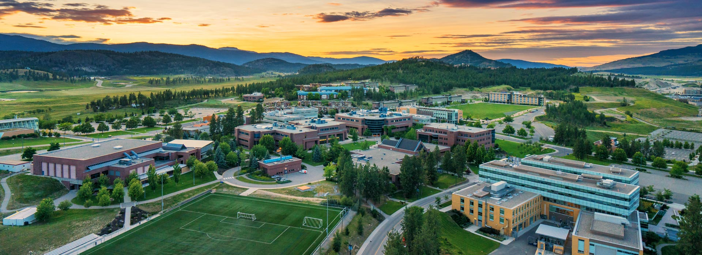

# UBC - Okanagan logistics {#ubc}




This page is devoted to the logistics of studying and conducting research at UBC - Okanagan. Both the lab's research, and UBC's policies and procedures are continually shifting. It is very possible that there is information missing, or that elements of this page are out of date. If you notice that there is incorrect or missing information, please let Dr. Noonan know.


## Undergraduate engagement

There are multiple pathways for engaging undergraduate researchers at UBC. Here are some of them:

+ **Biology Honours Thesis**: Biology students in the Honours track complete independent thesis projects under the supervision of a UBC faculty member. They begin to identify labs in the fall of their third year (and then complete their thesis in their fourth year, although they may start in the summer between their third and fourth years). It is recommended that you start thinking about this early. The process of finding an Honours supervisor begins by contacting potential supervisors, or speaking with the program coordinator.
+ **Directed Studies students**: Biology students at any stage of their degree can complete independent research projects for course credit (8-10 hours/week). In the quantitative ecology lab, students taking a 3-credit directed studies are required to write a 10+ page report at the culmination of their study, those taking a 6-credit are required to write a 15+ page report.
+ **Work-Study Students**: The Work-Study program provides paid opportunities for undergraduates to work on campus, including in labs, up to 20 hours a week during the summer. The work does not necessarily have to be research-oriented or educational, but generally is. The lab pays for the student's wage, with a subsidy provided by the university. More information [here](https://students.ok.ubc.ca/career-experience/get-experience/work-study/)
+ **NSERC USRA**: The NSERC Undergraduate Student Research Awards provides an award subsidy to hire Canadian/permanent resident undergraduates during the summer to work on your research projects while allowing students to explore workplace and research skills. Applications are usually early in the year (Jan-March) for summer. More information [here](https://science.ok.ubc.ca/awards/undergraduate/nserc-usra/)
+ **Volunteers**: There are always many students who are looking to volunteer in the Quantitative Ecology Lab. We prefer to give opportunities for either pay or credit, however, to promote equity and ensure that everybody is on the same page regarding expectations.

## Office space

Our lab facilities are located on the third floor of the Science building. Our lab is SCI 354. Members of the lab are welcome to use lab space on a first-come, first-serve basis. To access the lab you will need SALTO access. Contact Dr. Noonan if you need this.

If you wish to have a meeting in the lab space (in person or virtual), please note it on the room calendar (on the back of the door) so that other lab members are aware of the meeting and can plan accordingly.

You are welcome to eat and drink in the lab, but please be careful around the computers. The lab has a fridge and microwave and you are welcome to use these. Please ensure you respect other people's food and clean up after yourself using the microwave.


## Computing

We have shared lab computers, and you should be prepared to coordinate time on the computers with other lab members (you can use the Slack channel #lab-computers for this). If you are accessing a computer remotely, please try to use the two linux machines as these can support multiple simultaneous users.

Our lab has a private network, which must be accessed via the VPN and your CWL. Our lab also has allocations on the UBC Advanced Research Computing Platforms Sockeye (for computation) and Chinook (for object storage). To use these allocations, you must be added to Dr. Noonan's account. Please contact him for more information on this.

### Remote Desktop Access

Accessing a Quantitative Ecology Lab computer remotely requires two pieces of software: **Cisco AnyConnect VPN** and a remote desktop application. Follow the steps below for your operating system.

#### Step 1: Connect to the UBC VPN

1. Download and install **Cisco AnyConnect VPN** from [myvpn.ubc.ca](https://myvpn.ubc.ca/+CSCOE+/logon.html). If that link does not work, try [download.ubc.ca](https://download.ubc.ca).
2. Download and install the **DUO app** on your phone. This is required for two-factor authentication.
3. Open Cisco AnyConnect, enter **myvpn.ok.ubc.ca**, and press Connect.
4. Enter your CWL credentials. The username format varies -- try these in order if one does not work:
   - `cwlusername.ubco.sarahs@app` with your CWL password, then approve via DUO on your phone
   - `cwlusername.ubco.sarahs@123456` with your CWL password, using the 6-digit DUO passcode
   - `cwlusername@123456` with your CWL password

#### Step 2: Connect to a lab computer

The lab has five Windows workstations (WS01--WS05) and two Linux machines (WS06/s01 and S02, the supercomputer in EME).

**Windows (PC)**

1. Open **Remote Desktop Connection** (press the Windows key and type "Remote Desktop Connection").
2. Enter the hostname of the computer you want to access (e.g., `WS01.qel.ok.ubc.ca`).
3. Click *Show Options* and enter your username as `ead\CWLusername` and your CWL password. The `ead\` prefix is required.
4. You may receive a security certificate warning -- check that the certificate name contains "OK", "ead", and "UBC" before proceeding.

**Mac**

1. Connect to the UBC VPN via Cisco AnyConnect as described in Step 1.
2. Open a terminal and SSH into the lab computer using your CWL credentials:

```bash
   ssh CWLusername@WS##.qel.ok.ubc.ca
```

   Enter your CWL password when prompted.

For a graphical interface, you can also:

1. Download **Windows App** from the [Mac App Store](https://apps.apple.com/us/app/windows-app/id1295203466?mt=12).
2. Follow the same connection steps as Windows above.

**Linux**

1. Connect to the UBC VPN via Cisco AnyConnect as described in Step 1.
2. Open a terminal and SSH into the lab computer using your CWL credentials:

```bash
   ssh CWLusername@WS##.qel.ok.ubc.ca
```

   Enter your CWL password when prompted.

For a graphical interface, you can also use **x2go**:

1. Download and install x2go following the instructions at [help.ece.ubc.ca/X2go](https://help.ece.ubc.ca/X2go).
2. Open x2go and click *New Session*. Enter the following:
   - Host: `WS##.qel.ok.ubc.ca`
   - Login: CWL username (do not include `ead\`)
   - Password: CWL password
   - Session type: MATE
3. Double-click the session to connect and enter your credentials when prompted.

#### Ending a remote session

When you are done, you can either close the window while staying logged in (useful if code is still running) or log out and close the window. Do not log out if you have a long process running -- closing the window without logging out will allow it to continue.

More information on remote access can be found [here](https://github.com/QuantitativeEcologyLab/LabInfo/tree/main/How_to).

### Best Practices Guide for Lab Computers

**Before using a lab computer/laptop:**

- Our computers are a shared resource. Do your best to choose the lowest power computer appropriate for your task.

**While using a lab computer/laptop:**

+ If running any programs/tasks passively on the computer, use the Slack channel (#lab-computers) to inform others. Make sure to include enough details regarding:
  + which computer you're running it on,
  + what task is running,
  + roughly how long you expect it to run or when you'll be checking in on it,
  + and if the computer can be used for other tasks in the interim.
+ If finished with a task earlier than anticipated and someone is scheduled to use the computer next, send a quick message into the Slack channel so they can know it is available sooner. 
+ If the computer is running Windows OS, shut it down at the end of the day if it isn't running anything in the background or you don't intend on accessing it remotely in the very near future. The computers need to be powered down on a regular basis to ensure they continue to function optimally.
+ If you are unsure whether a computer should be shut down because programs or files are still open and there is no information posted in Slack, check with the last user before powering it off. If you are still unsure, leave it powered on.
+ Avoid touching the monitors. If a monitor is dirty use only water and a microfibre cloth to clean it. DO NOT use any cleaning products on it.


## Finance and Purchasing

We will use the [Workday](https://hr.ubc.ca/working-ubc/welcome-workday) platform for procurement and reimbursement. 

We have a lab credit card for research-related purposes. Please discuss use of the credit card with Dr. Noonan before making a purchase, and check to make sure the intended expense falls under one of our grants. Be sure to get an itemized receipt and process your reimbursement through workday with the applicable grant code.

### General notices for purchasing

In general, you are unlikely to have to undertake any purchasing on your own. However, in the case that you require purchasing equipment, please consult this section and confirm any purchases with Dr. Noonan.

- **DO NOT** under any circumstance share the lab credit card information with anyone outside of the lab. Please also do not auto-save the credit card information on any web browser.
- When making a purchase with the lab credit card in another currency, please do not convert it. **UBC credit cards can make non-CAD purchases** with favourable rates and no fees, while vendors such as PayPal use different exchange rates and may charge extra fees. 
- Please ship orders to the [biology department](https://www.ubc.ca/about/contact-okanagan.html) rather than personal addresses. 
- For orders involving **importing** from international vendors, please request the seller to add the following broker information to facilitate shipping and customs clearance.

### Creating purchase orders

For purchases that we receive quotes for, we often have to file a purchase order (PO) on WorkDay with the exact amount and items from the quote. Suppliers who provide quotes will then be issued an invoice so they can ship our requested items to us. We will also receive quotes from our colleagues and collaborators for field and research equipment of which we have to report to UBC. This section describes the necessary steps and tips in order to create and file POs via WorkDay.

To file a PO follow the ["Create Purchase Requisition – Non-Catalogue" steps](https://ubc.service-now.com/selfservice?id=kb_article_view&sys_kb_id=562eef9f1ba5b990ba8f539f034bcb60). 

Listed below are some tips to help while filing POs:

- We will most often file a **Purchase Requisition** for any quotes that we receive. You would only fill out a **Bill Only (Retroactive)** requisition if a purchase has already been made and shipped to us.

- If a supplier is not listed in WorkDay, follow the ["Create Supplier Request" steps](https://ubc.service-now.com/selfservice?id=kb_article&sysparm_article=KB0016683). Do this before you file a PO, as you won't be able to file a PO otherwise. Make sure the supplier sends all necessary contact and banking information in order to properly fill out the supplier request form.

- Consult the [Grants spreadsheet](https://docs.google.com/spreadsheets/d/1e4gDe8_CZ4ZXxGoZUxjFZNogzWPJtn1oTwxg45oF5tw/edit?usp=sharing) for grant/speedchart codes and **always** consult with Dr. Noonan to make sure the right grant is applied to the PO.

- Make sure all expense lines in the PO add to the same amount in the received quote from the supplier.

- The tax section can be confusing, and all of the options are frankly not very informative on their own. Thankfully a member of the UBC Financial team will take care of any tax issues so leave the default options when filling out the PO.

- Once the items from the PO have been received, create a receipt for the PO by following the ["Create Receipt of Goods & Services" steps](https://ubc.service-now.com/selfservice?id=kb_article_view&sys_kb_id=4d9410a947cc4650efc6767b416d43fc).

- Generally, filing a PO is required for invoices **over $3500**. However, some goods and services are exempt from POs; they are listed in the ["PO Exemption Matrix"](https://finance.ubc.ca/system/files/PO_Exemption_Matrix.pdf). This notably includes journal publications (#2) and conference registration (#7)

- For some supplemental context behind procurement processes and policies, there are ["notes"](https://docs.google.com/document/d/19L4EtEjsOjB3vCWqCISVvSIkbpYBYGojYHIWcMDNRVs/edit?usp=sharing) in the Lab Logistics folder from UBC Finance's PO Process Workshop.

- If you need any help or run into any issues while filing a PO, email Emma Regush. She is responsible for financial administration in the department of biology, and can assist you with anything and everything PO related.


### Filing reimbursement 

If it so happens that an expense is charged to your own credit card rather than the lab credit card, please follow the relevant steps laid out [here](https://experience.apsc.ubc.ca/student-groups/finances/reimbursement-claims-purchases-paid-students).

Be sure to check with Dr. Noonan which grant the expense falls under. The **cost center** will autofill upon entering the grant code.

Also make sure to check the **enable tax** option, as the reimbursement will not go through otherwise.

## Zoom

UBC offers grad students zoom accounts with premium features, including no time limits on meetings. To get one create a zoom account with your UBC email and then send an email to av.helpdesk@ubc.ca asking them to license the account for research and TA'ing purposes.

## Printing

As a general rule, the Quantitative Ecology Lab tries to be paperless and there is no printing code. If you feel you need to have a work-related document printed, contact Dr. Noonan.

### Poster printing

You can find details on how to print posters through the university [here](https://www.suo.ca/paper-and-supply-co/). Expect up to 3 days between emailing and picking up the poster. The lab has a poster tube for conference travel should you need it.


## Travel

If you are travelling for reasons related to your work within the lab (e.g., conference, field work, workshops, etc.) you need to have a [safety plan](https://biology.ok.ubc.ca/wp-content/uploads/sites/135/2024/07/Field-Trip-BIOL-Domestic-Field-Work-Safety-Plan-Template-2024.pdf) in place to ensure that you are safe during your travel and that you are covered in case of any emergencies. These forms need to be submitted to the head of department for approval no latter than two weeks before any planned travel and you should work with Dr. Noonan to complete the paperwork well in advance.

## Fieldwork

For some members of the Quantitative Ecology Lab, fieldwork will be an important component of their research. This section is devoted to sharing information and expectations regarding local and international fieldwork.

### Planning

You will need to carefully plan your fieldwork as part of your overall work plan. Well before embarking on field work you should prepare the following items and/or discuss them with Dr. Noonan:

+ Objectives of field work
+ Proposed timing
+ Proposed budget (and sources of funds secured vs. needed). Can include range, e.g. from cheapest to dream budget
+ Permits: are permits required (e.g. from provincial/local governments? First Nations?)
+ Ethics: is an Animal Care or Human Ethics protocol required?
+ Safety: a field safety plan is required
+ Are there particular considerations regarding Equity, Diversity and Inclusion (including anti-racism, reconciliation, capacity-building)?


### Field safety

[UBC Student Safety Abroad](https://safetyabroad.ubc.ca/) has some information that is relevant for people traveling abroad for fieldwork. If you are doing international fieldwork, you will need to register with UBC’s [Safety Registry](https://registry.safetyabroad.ubc.ca/). Depending on the country you are going to, there may be additional steps or forms you will need to take or fill out (e.g register with the Canadian government). Be sure to check the government page for travel advisories. The email for Safety Abroad is safety.abroad@ubc.ca. On campus, they are located in the UBC Life Building (1100-6138 Student Union Boulevard). 

Physical and emotional safety is paramount in the field. If you ever feel unsafe, please try to leave the situation and contact Dr. Noonan immediately.

#### Field safety plans

Prior to conducting any field research while affiliated with UBC, you must complete a travel and field safety form to be approved through the Department of Biology.

Generally, while preparing for fieldwork, you should ask and/or know about the following:

- Who and where are your points of contact in case of emergency? This includes people locally (eg. emergency services) as well as back home (eg. partners)
- How will you communicate with teammates, and what are the rules/expectations?
- How will you be transported to and between locations? Be sure to make your itinerary clear.
- What should you expect? What are the risks, protocols, and required training? Again, a clear itinerary is important.
- What are the no-go criteria? In what circumstances will the fieldwork be halted for the day or entirely?
- What are the health related protocols? eg. first-aid kit, people with first-aid certification (see below), required vaccinations, protocols for people needing regular medication/treatment. 

#### First aid

All lab members are strongly encouraged to complete a wilderness first aid course prior to their first field season. Coast Wilderness Medical Training offers a 40-hour wilderness first aid course about twice a month. The course is taught in Pacific Spirit Park and can either be taken over two weekends or in 4 consecutive days. Upon completion you will earn a Red Cross Wilderness First Aid certificate with CPR-C. Dr. Noonan can cover the expenses of this course.

#### Preparing for the field

The following steps will all help with field preparation *and* the actual trip itself.

- Familiarise yourself with your destination. This includes knowing where the nearby towns are, and identifying potential risk factors. 
- Complete training (eg. wilderness first aid) and practice skills (relevant vehicle/equipment use, backpacking, familiarizing yourself with recent research)
- Collect and stock up on your gear and supplies. Know what you'll have access to, and start collecting early in case you have trouble obtaining something.
- Get to know your team.

#### Travel insurance & medical care

UBC Health Insurance provides Travel Insurance, however, not all medication is covered (e.g. anti-malarial medication) and most travel vaccines are not covered. For detailed information about what may or may not be covered by your insurance plan, it is recommended that you check out the AMS Student Care website and to directly contact Student Health Services (1-877-795-4421).

If you need medication or vaccines for travel to particular countries you can get these at a travel clinic. There are several located throughout Kelowna and you may need to call ahead for an appointment or to check that the vaccine you need is in stock at the clinic. 

### Field vehicle

Our lab field vehicle is a Subaru Outback. To drive, you will need to have a driver’s license, be comfortable driving under muddy and rugged conditions with unpredictable wildlife, and to know the basics of changing a tire and checking fluids. You will need to demonstrate your driving abilities prior to being cleared to drive on your own. 

## Safety

Safety is the first and foremost priority. If there is a serious emergency such as a fire or injury, first call 911 then call campus security (250)-807-8111, then call Dr. Noonan. Any safety concerns should be brought to Dr. Noonan.

## Job boards and resources

Looking for jobs or opportunities in ecology/conservation? Here are some suggested resources.

- [ECOLOG-L](https://www.esa.org/membership/ecolog/): managed by the Ecological Society of America
- [Texas A&M Job Board](https://jobs.rwfm.tamu.edu/)
- [Conservation Job Board](https://www.conservationjobboard.com/)
- [UVic Jobs in Environmental Studies and Ecology Facebook group](https://www.facebook.com/groups/307052086090314/)
- [Ecological Society of America](https://www.esa.org/career-development/)
- [Society for Conservation Biology Job Board](https://careers.conbio.org/)
- [The Wildlife Society](https://careers.wildlife.org/home/home.cfm/)
- [Ornithology Jobs](https://ornithologyexchange.org/jobs/board/)
- [NatureJobs](https://www.nature.com/naturecareers/)

[Aerin Jacob's](http://www.aerinjacob.ca/jobs.html) website has an extremely helpful page with advice and resources for careers in conservation. 
